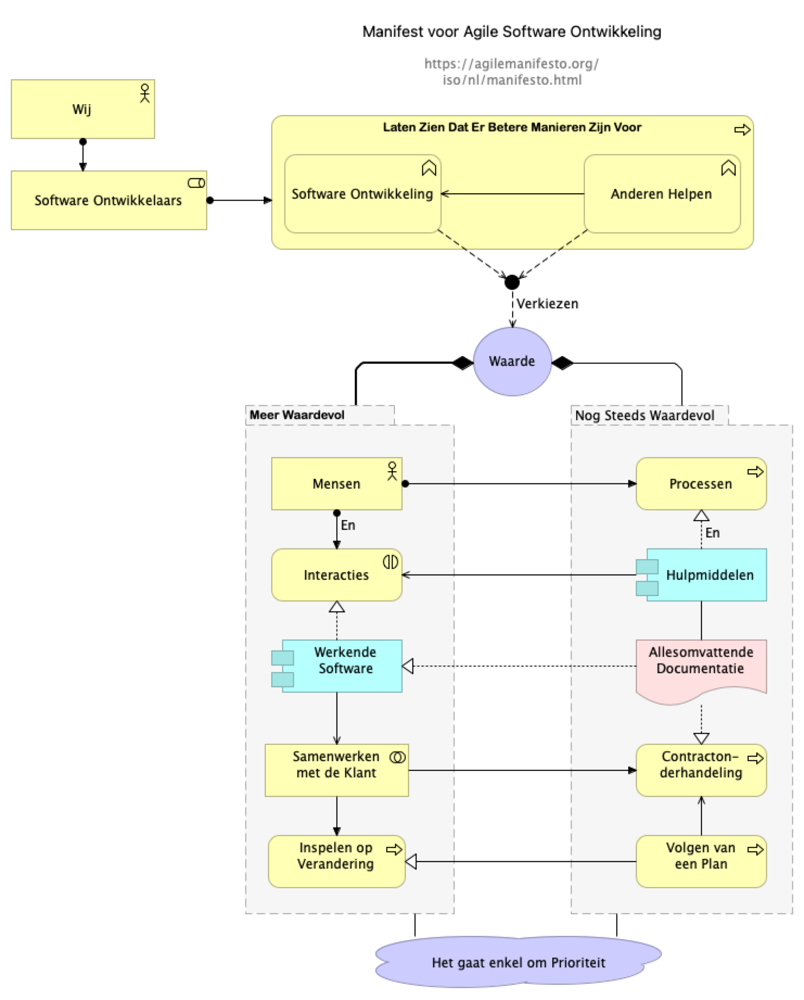
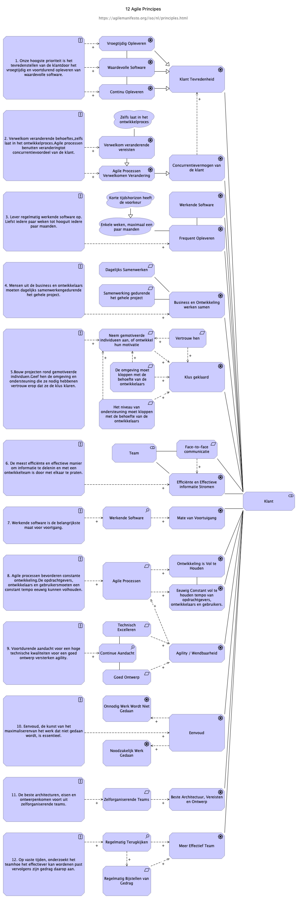

# Agile manifesto in ArchiMate

Nederlandse vertaling van https://github.com/teterkin/Agile-manifesto-in-ArchiMate
door Willem Kossen, Lead Architect van BKWI

`English Notes at the bottom of this file`
  
## Agile manifesto

Source file: [Agile-Manifesto.archimate](Agile-Manifesto-NL.archimate)

## 12 Principles of Agile Software

Source file: [Agile-Manifesto.archimate](Agile-Manifesto-NL.archimate) (same file as above).

This is the Dutch language translation of https://github.com/teterkin/Agile-manifesto-in-ArchiMate
I'm thankful for his work on which i could build this one.
